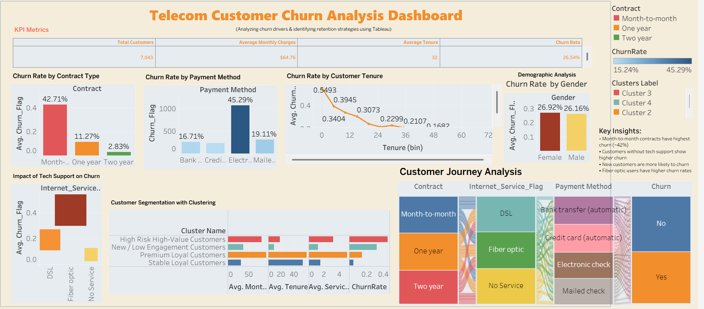

# 📊 Telecom Customer Churn Analysis Dashboard

🔗 **Live Dashboard:**  
(https://public.tableau.com/views/TelecomCustomerChurnAnalysisDashboard_17739415636730/Dashboard1?:language=en-GB&:sid=&:redirect=auth&:display_count=n&:origin=viz_share_link)

---

## 🚀 Project Overview
Customer churn is a critical problem in the telecom industry, directly impacting revenue and customer lifetime value.

This project analyzes **7,000+ customers** using Tableau to identify **key churn drivers**, detect **high-risk segments**, and provide **actionable retention strategies**.

---

## 🎯 Business Problem
The telecom company is experiencing a **high churn rate (~26.54%)**, leading to revenue loss and increased customer acquisition cost.

**Objective:**
- Identify why customers are leaving  
- Detect high-risk customer segments  
- Recommend data-driven strategies to reduce churn  

---

## 📌 Key Metrics
- **Total Customers:** 7,043  
- **Churn Rate:** 26.54%  
- **Average Monthly Charges:** $64.76  
- **Average Tenure:** 32 months  

---

## 🔍 Key Insights
- 📉 Month-to-month contracts have the highest churn (~42%)  
- 💳 Electronic check users show highest churn (~45%)  
- 📡 Fiber optic users churn more than DSL users  
- 🧑‍💻 Customers without tech support have higher churn risk  
- ⏳ New customers (low tenure) are most likely to churn  
- 👥 Gender has minimal impact on churn  

---

## 📊 Dashboard Features
- Interactive filters (Contract, Services, Segments)
- KPI metrics for quick overview
- Churn analysis by:
  - Contract Type
  - Payment Method
  - Customer Tenure
  - Service Usage
- Customer segmentation using clustering
- Customer journey visualization (Sankey-style flow)

---

## 🧠 Analysis Performed
- Created calculated fields:
  - `Churn Rate = AVG(Churn_Flag)`
  - Tenure bins for cohort analysis
- Performed segmentation using clustering:
  - High-risk customers
  - Low engagement customers
  - Loyal customers
- Compared churn behavior across services and payment methods

---

## 💡 Business Recommendations
- 🎯 Convert month-to-month customers to long-term contracts  
- 💳 Encourage auto-pay instead of electronic check  
- 🧑‍🔧 Promote tech support services  
- ⚡ Focus on early retention (first 3–6 months)  
- 🎁 Target high-risk segments with personalized offers  

---

## 📈 Expected Business Impact
- Potential churn reduction by **5–8%**  
- Improved customer retention  
- Increased customer lifetime value (CLTV)  
- Reduced acquisition cost  

---

## 🛠️ Tools & Technologies
- Tableau (Data Visualization)
- Data Cleaning & Feature Engineering
- Clustering (K-Means)

---

## 📂 Project Structure

```
Telecom-Churn-Analysis/
│
├── data/
│   └── telecom_churn_dataset.csv
│
├── dashboard/
│   └── telecom_churn_dashboard.twbx
│
├── images/
│   ├── dashboard_overview.png
│   ├── churn_by_contract.png
│   ├── churn_by_tenure.png
│   └── customer_journey.png
│
├── README.md
```

---

## 🖼️ Dashboard Preview



---

## ⭐ What Makes This Project Stand Out
- Focus on **business problem → insight → action**
- Quantified insights (not generic analysis)
- Combination of **EDA + segmentation + storytelling**
- Clear alignment with real-world business decisions

---

## 🙋‍♀️ About Me
Data Analyst skilled in SQL, Python, Tableau, and Machine Learning, passionate about solving real-world business problems using data.

---

## ⭐ If you found this useful
Feel free to ⭐ this repository or connect with me!
